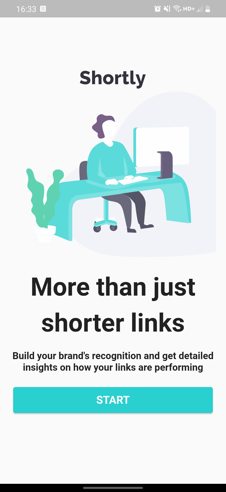
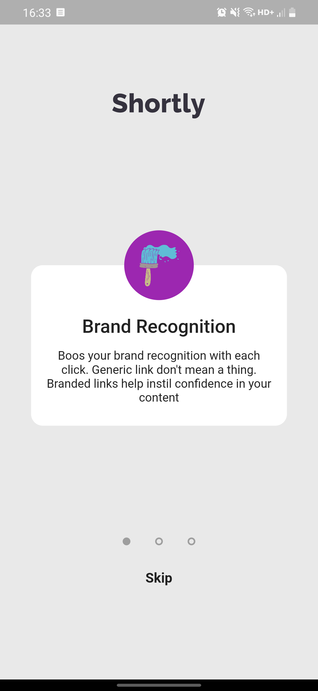
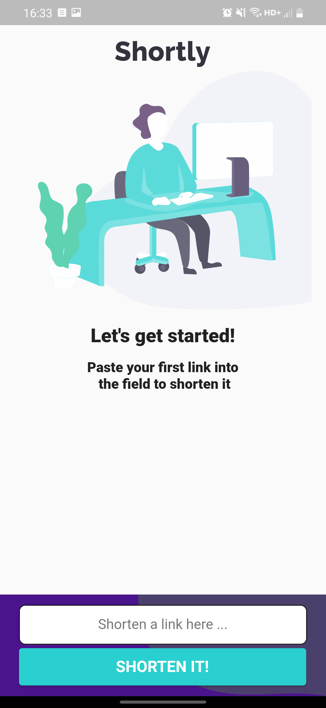
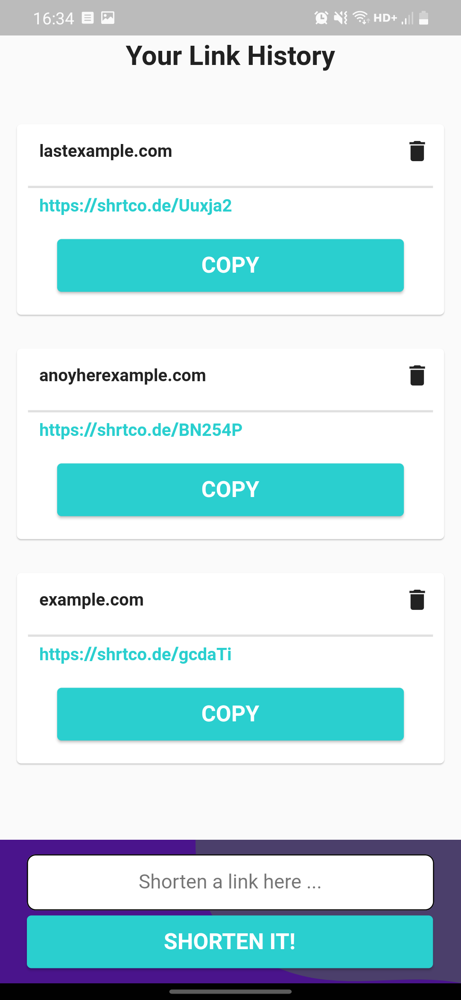
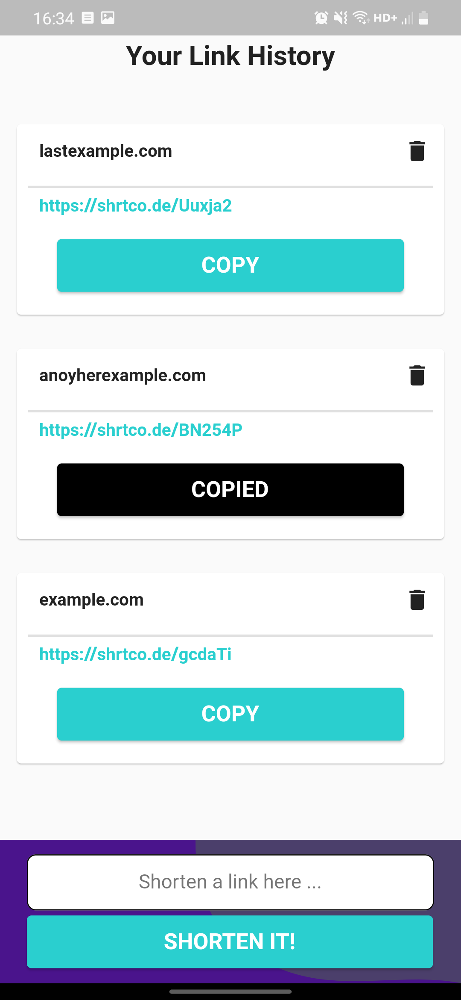

# Shortly

* [İstenen uygulama tasarımı](demo/istek_video.m4v) 

## Kullandığım paketler

* [Get](https://pub.dev/packages/get) (Route&state managment)
* [flutter_svg](https://pub.dev/packages/flutter_svg) (Svg gösterimi)
* [carousel_slider](https://pub.dev/packages/carousel_slider) (Welcome sayfası slider gösterimi)
* [http](https://pub.dev/packages/http) (Api bağlantısı)
* [string_validator](https://pub.dev/packages/string_validator) (Url doğrulaması)
* [fluttertoast](https://pub.dev/packages/fluttertoast) (Toast mesajı)
* [sqflite](https://pub.dev/packages/sqflite) (Veritabanı)
* [clipboard](https://pub.dev/packages/clipboard) (Bağlantı kopyalama)

## Apk dosyası

* [app-release.apk](https://github.com/fluttertests/grisoft_code_challange/blob/main/demo/app-release.apk) 

## Uygulama önizlemesi

  
  
  
  
  

